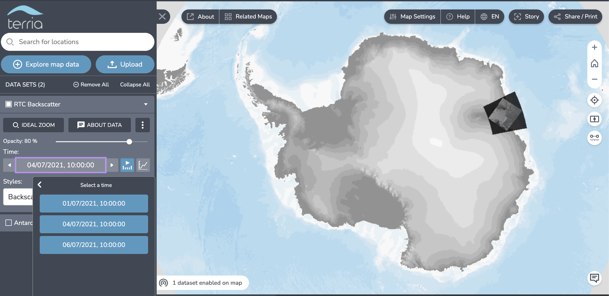

# MVP for Digital Earth Antarctica Open Data Cube

This repository contains code to set up a minimal working Open Data Cube with OWS capability. 

## Simple launch with docker-compose

This repository contains a [docker-compose configuration file](compose.yml) that describes two services:
* `postgis` which contains the postgis database
* `ows` which contains the `datacube-core` and `datacube-ows` libraries

The `ows` service is responsible for adding products and datasets to the database managed by the `postgis` service. 
The `ows` service will also run the flask app for serving the webservices created by `datacube-ows`

Data is indexed from a public AWS S3 bucket - there is no need to have credentials for AWS.

Follow the instructions below to run the services:

1. Clone this repository
    ```
    git clone https://github.com/caitlinadams/odc-mvp.git
    ```

1. Enter the repository directory and run docker compose:
    ```
    cd odc-mvp
    docker compose up
    ```
1. One the OWS service reports that it is running on http://127.0.0.1:8000, view the WMS GetCapabilities page:
    ```
    http://localhost:8000/?service=wms&request=getcapabilities
    ```
1. To view in a service like Terria, add the above URL as a web data set. 
1. When finished, shut down the services by running:
    ```
    docker compose down
    ```

## Data
The data used in this demo are three SAR images over Antarctica. 
The original data is EPSG:3031 (Antarctic Polar Sterographic).

The three scenes are:
* [S1A_EW_GRDM_1SDH_20210701T150428_20210701T150533_038585_048D91_23E6](https://deant-data-public-dev.s3.ap-southeast-2.amazonaws.com/index.html?prefix=experimental/pyrosar-ew-rtc/S1A_EW_GRDM_1SDH_20210701T150428_20210701T150533_038585_048D91_23E6/)
* [S1A_EW_GRDM_1SDH_20210704T152833_20210704T152942_038629_048EE8_D41F](https://deant-data-public-dev.s3.ap-southeast-2.amazonaws.com/index.html?prefix=experimental/pyrosar-ew-rtc/S1A_EW_GRDM_1SDH_20210704T152833_20210704T152942_038629_048EE8_D41F/)
* [S1A_EW_GRDM_1SDH_20210706T151222_20210706T151326_038658_048FD4_8688](https://deant-data-public-dev.s3.ap-southeast-2.amazonaws.com/index.html?prefix=experimental/pyrosar-ew-rtc/S1A_EW_GRDM_1SDH_20210704T152833_20210704T152942_038629_048EE8_D41F/)

## What to expect

Datasets should be located in East Antarctica.
There are three time steps.
